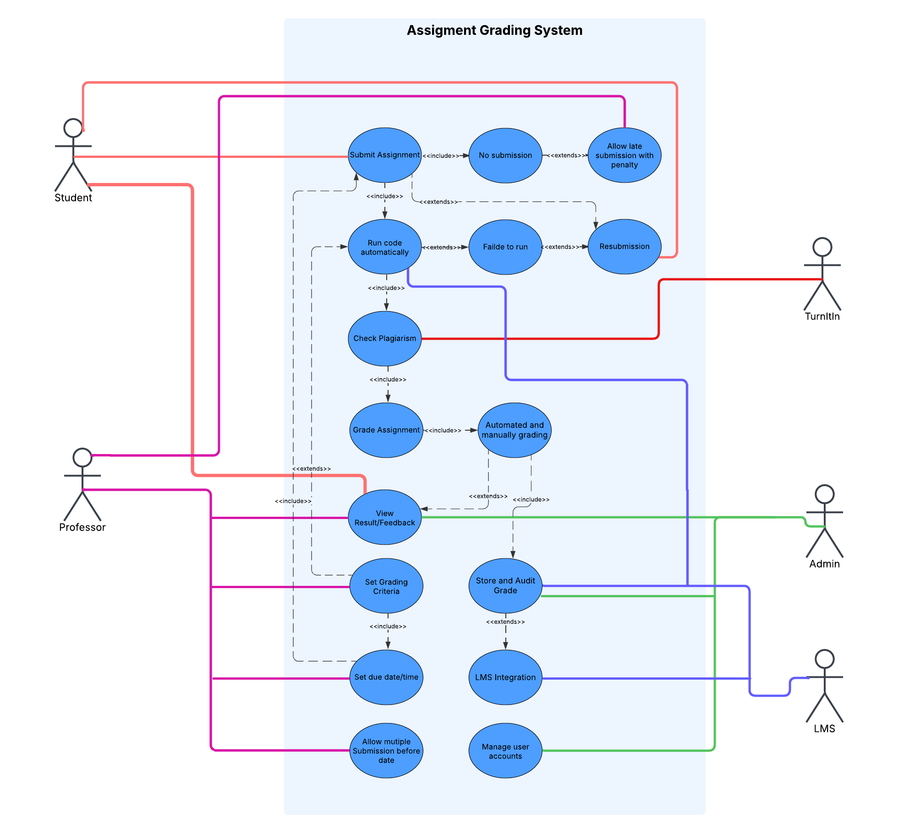
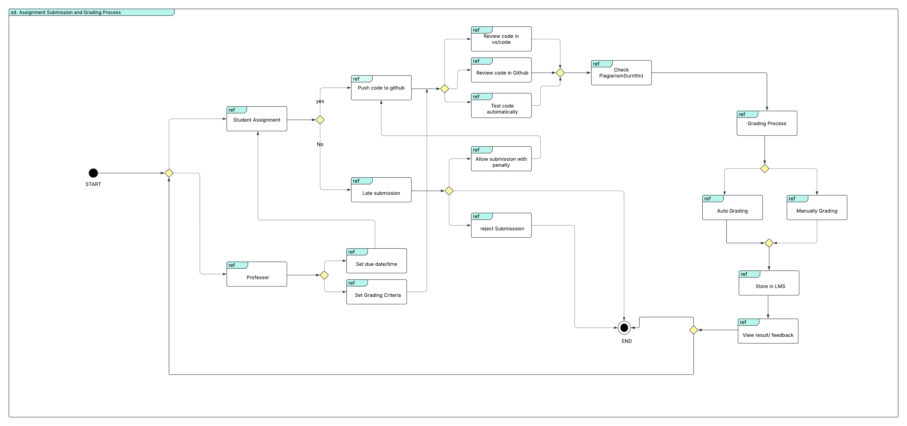

# Assignment Submission and Grading Process

1.Introduction
The purpose of this is to analyze the assignment grading system using different Unified Modeling Language (UML) diagrams. The focuses on an Interaction Overview Diagram (IOD) from a context viewpoint and a Use Case Diagram (UCD) from a functional viewpoint. These diagrams provide insights into how students submit assignments, how professors grade them, and how the system ensures fairness and efficiency.

2.Interaction Overview Diagram (Context Viewpoint)
The Interaction Overview Diagram illustrates the assignment submission and grading process at a high level, focusing on the interactions between students, professors, and supporting systems.

Student Interaction: Students plan and submit their assignments using GitHub. They may face issues such as runtime errors, requiring resubmission.

Professor Interaction: Professors retrieve submissions, execute code, and grade assignments. If issues arise, students must resubmit.

Automated Processes: Code execution and plagiarism checks ensure correctness and originality before grading.

Final Steps: Professors finalize grades and generate reports, concluding the process.

3.Use Case Diagram (Functional Viewpoint)
The Use Case Diagram represents the functional interactions within the assignment grading system. It captures the primary actors and system functionalities.

Actors:

Student: Submits assignments, views feedback, and resubmits if needed.

Professor: Grades assignments, sets grading criteria, and generates reports.

Admin: Manages user accounts, LMS integration, and stores grades.

LMS & Turnitin: Handles plagiarism detection and learning management system integration.

Key Use Cases:

Submit Assignment: Students upload their work.

Run Code Automatically: System checks execution success.

Check Plagiarism: Ensures originality using Turnitin.

Grade Assignment: Automated/manual grading by professors.

View Results & Feedback: Students access evaluation outcomes.

Set Grading Criteria: Professors define evaluation parameters.

Store & Audit Grades: Admin oversees grade storage and integrity.

LMS Integration: Ensures seamless academic record management.

The UML diagrams provide a clear visualization of the assignment grading system, emphasizing its structured workflow. The Interaction Overview Diagram highlights the sequential flow of interactions, while the Use Case Diagram showcases the system’s key functionalities. Together, they facilitate efficient assignment handling and grading.

This presents a structured breakdown of the assignment grading system, ensuring clarity in process representation and functional coverage. By integrating multiple UML diagrams, the report effectively conveys system roles and interactions, making it a valuable reference for system development and optimization.

