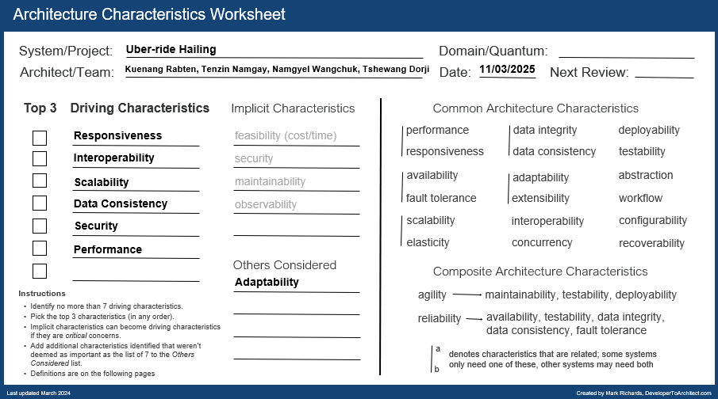

# Architecture Characteristic Worksheet

## 1. Responsiveness  
(The amount of time it takes to deliver a response to the user.) 

Reason  
With reference to the requirement stating that the system must provide the "richest user interface possible across all deployment platforms", responsiveness ensures users can interact with the system seamlessly (e.g., loading trips, sharing to social media). Server-side processing of 10,000+ concurrent requests would degrade latency, especially for global users.  

Use Case  
- Scenario: A user searches for nearby hotels or car rentals during busy travel times.  
- Problem: The server can’t handle all the location requests quickly, causing slow results.  
- Solution: The app uses the phone’s GPS to find the user’s location and sends it directly to hotel/car rental services.  
- Outcome: Results appear in under 1 second, avoiding delays from the overloaded server.  

Tradeoff & Mitigation  
- Tradeoff: Client-side processing increases mobile app complexity.  
- Mitigation: Use cross-platform frameworks (e.g., React Native) to maintain code simplicity.  

## 2. Interoperability  
(The ability of the system to integrate and exchange data with heterogeneous third-party services.)  

Reason  
With reference to the requirement stating that the system must interface with the agency’s existing airline, hotel, and car rental interface systems and support "favored vendor" partnerships, the system must seamlessly integrate diverse APIs. This means the system normalizes data formats (e.g., SOAP/XML for legacy airline systems, REST/JSON for hotels) to ensure consistency. Users expect reservations—automatically loaded via frequent flier accounts, hotel memberships, or car rental rewards programs—to appear in a unified dashboard without fragmentation.  

Use Case  
- Scenario: A user connects their airline rewards account (older system) and hotel rewards account (newer system) to see all bookings in one trip.  
- Problem: The system can’t combine old airline data with modern hotel data, causing errors like wrong dates or missing bookings.  
- Solution: A tool (API gateway) converts the different data formats into one standard format (like JSON).  
- Outcome: The user sees their flights, hotels, and rentals neatly organized in one trip view, with no errors or manual fixes needed.  

Tradeoff & Mitigation  
- Tradeoff: Supporting old and new systems (like SOAP and REST) makes the system harder to build and maintain.  
- Mitigation: Use a tool like AWS API Gateway to manage differences between systems and make everything use the same format (e.g., JSON).

## 3. Scalability  
(A function of system capacity and growth over time; as the number of users or requests increases in the system, responsiveness, performance, and error rates remain constant.)

Reason  
With reference to the requirement stating that the system will serve 10,000+ registered users worldwide and work internationally, the system must scale efficiently. This means that as the number of users or requests increases, the system should not suffer from latency or degraded performance. Users will interact with the system continuously, making frequent requests to third-party services (airlines, hotels, car rentals) and accessing their dashboards simultaneously. The system must handle these increasing loads effortlessly to ensure reliability and usability.  

Use Case  
- Scenario: During a major holiday season (e.g., Christmas, New Year), 8,000 users worldwide simultaneously log in to check their trip dashboards, refresh flight statuses, and book last-minute hotel deals from "favored vendors".  
- Problem: Without scalable infrastructure, the server would struggle to process 8,000 concurrent API calls to third-party systems, resulting in slow response times (>5 seconds) and potential crashes.  
- Solution: The system scales horizontally using AWS auto-scaling, dynamically spinning up 50 additional backend instances to distribute the load.  
- Outcome: Users experience consistent sub-2-second response times, and the system maintains 99.9% uptime during peak traffic, ensuring a smooth user experience.  

Tradeoff & Mitigation  
- Tradeoff: Horizontal scaling increases cloud operational costs (e.g., AWS instance fees).  
- Mitigation: Use auto-scaling policies to add/remove instances based on real-time demand (e.g., scale down during off-peak hours).