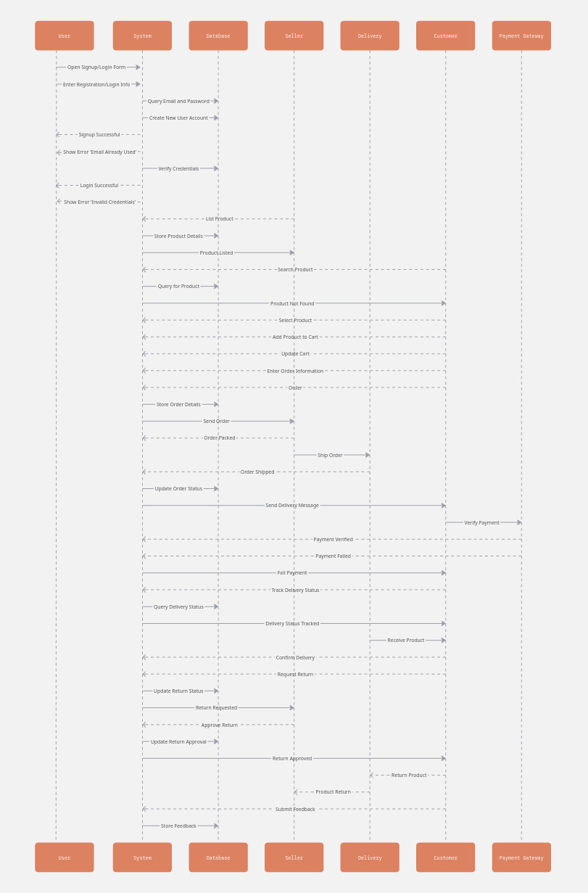

# Sequence Diagram For Local Market

# Online Shopping System Workflow Analysis Report

## Introduction

The sequence diagram illustrates the comprehensive workflow of an e-commerce platform, detailing interactions between seven key components: User, System, Database, Seller, Delivery, Customer and Payment Gateway. This report analyzes the complete transaction lifecycle from user registration to post-purchase activities.

---

## User Authentication Flow

The workflow begins with user authentication consisting of two primary paths:

### New User Registration

- User initiates by opening the signup/login form  
- User enters registration details  
- System queries the database to verify email uniqueness  
- If email is already registered an error is displayed  
- If email is unique, the system creates a new user account  

### Existing User Login

- User enters login credentials  
- System verifies credentials against database records  
- System displays appropriate feedback for successful or failed login attempts  

---

## Product Search and Selection Process

Once authenticated, users can browse and select products through:

### Product Listing

- System retrieves and displays product catalog  
- Product details are stored and managed in the database  

### Product Search

- User initiates product search  
- System queries database for matching products  
- Results are returned to user, with appropriate messaging for unfound items  

### Product Selection

- User selects desired product  
- Product is added to shopping cart  
- User can update cart contents as needed  

---

## Order Processing

The order processing workflow includes:

### Order Creation

- User enters shipping and billing information  
- Order details are captured by the system  
- Order information is stored in the database  
- Order is transmitted to the seller  

### Order Fulfillment

- Seller processes the order  
- Order status is updated in the system  
- Order is shipped to delivery service  
- System updates delivery status  

---

## Payment Processing

Payment handling follows a secure flow:

### Payment Verification

- Payment request is sent to payment gateway  
- Gateway verifies payment details  
- Payment status (verified or failed) is returned to system  
- System updates order status accordingly  

### Payment Failure Handling

- System processes failed payments  
- User is notified of payment issues  

---

## Delivery and Post-Purchase Activities

The final stages of the workflow include:

### Delivery Tracking

- User can query delivery status  
- System retrieves tracking information  
- Delivery confirmation is recorded upon product receipt  

### Return Processing

- User can request product returns  
- Return requests are processed by the system  
- Seller approves or denies return requests  
- Approved returns trigger product return process  
- Product is returned to seller  

### Feedback Collection

- User submits feedback on their experience  
- Feedback is stored in the database for future reference  

---

## Conclusion

The sequence diagram demonstrates a robust online shopping system with comprehensive handling of the entire customer journey. The workflow efficiently manages user authentication, product discovery, order processing, payment verification, delivery tracking, and post-purchase activities including returns and feedback collection.

