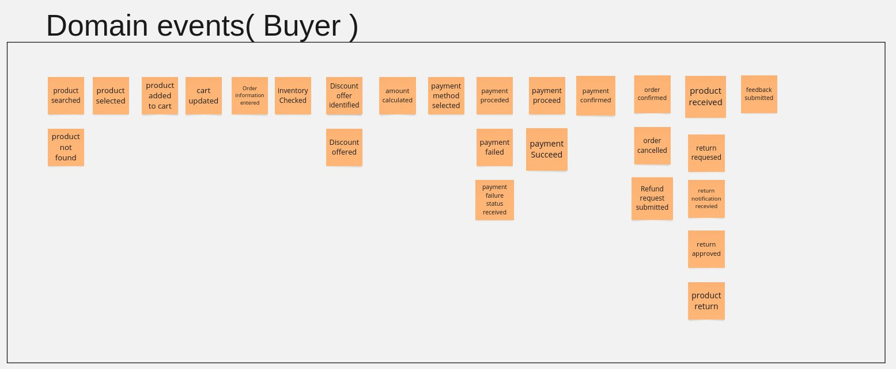
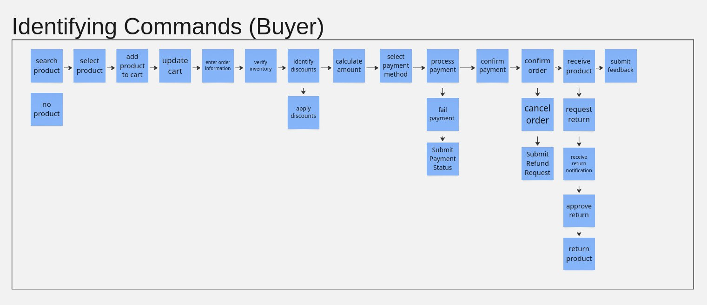
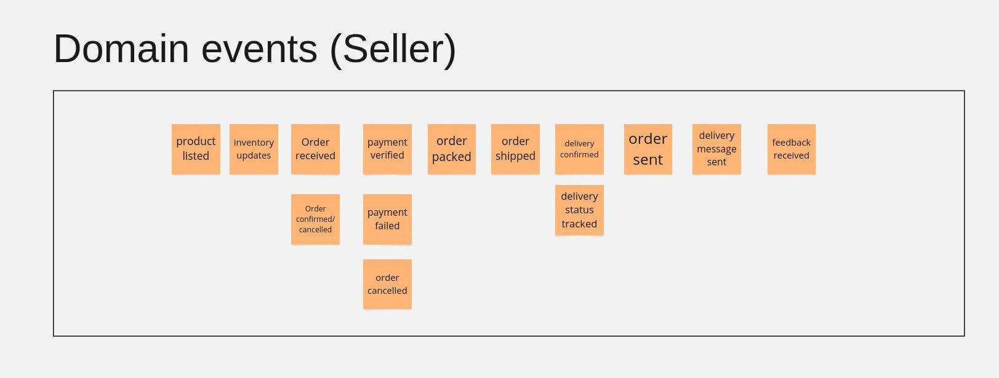
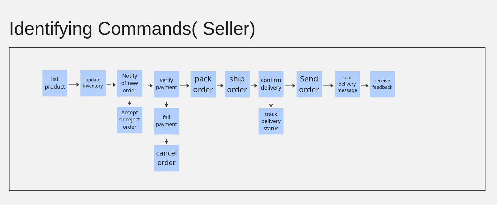

# Event Storming for the Marketplace Application

## Doment event for the buyer

- **Product searched**: The buyer initiates a search for a product.
- **Product not found**: No matching product is available.
- Product selected: The buyer selects a product to view in detail.
- Product added to cart: The buyer adds a product to the shopping cart.
- Cart viewed: The buyer views the contents of the shopping cart.
- Order information entered: The buyer enters shipping and billing 
- Inventory checked: The system checks the availability of the product.
- Discount applied: Applicable discounts are applied to the order.
- Payment initiated: The buyer initiates the payment process.
- Payment successful: The payment is successfully processed.
- Payment failed: The payment process fails.
- Order confirmed: The order is confirmed and an order number is generated.
- Order prepared: The order is prepared for shipment.
- Order shipped: The order is shipped to the buyer.
- Order delivered: The order is delivered to the buyer.
- Order cancellation requested: The buyer requests to cancel the order.
- Order cancellation confirmed: The order cancellation is confirmed.
- Refund processed: The refund is processed for the buyer.
- Return requested: The buyer requests to return the product.
- Return approved: The return request is approved.
- Product returned: The product is returned by the buyer.
- Refund processed: The refund is processed for the returned product.
- Feedback submitted: The buyer submits feedback for the product or service.

## Identified commands for the buyer 

 Search product: The buyer searches for a product.
- No product: The search does not return any results.
- Select product: The buyer selects a product from the search results.
 Add product to cart: The buyer adds the selected product to their shopping cart.
- Update cart: The cart is modified (e.g., quantity updated, product removed).
- Enter order information: The buyer provides details like shipping address and billing information.
 Verify inventory: The system checks product availability.
- Identify discounts: The system looks for applicable discounts.
- Apply discounts: The identified discount is applied to the order.
- Calculate amount: The system calculates the final payable amount (including discounts, taxes, and shipping).
- Select payment method: The buyer chooses a payment option.
- Process payment: The system initiates the payment transaction.
- Fail payment: The payment process fails.
- Submit payment status: The system updates the payment status (success or failure).
- Confirm payment: The system verifies successful payment.
- Confirm order: The system confirms the order.
- Receive product: The buyer receives the product.
- Cancel order: The buyer or system cancels the order.
- Submit refund request: The buyer submits a refund request.
- Request return: The buyer initiates a product return.
- Receive return notification: The system acknowledges the return request.
- Approve return: The return request is approved.
- Return product: The buyer sends back the product.
- Submit feedback: The buyer provides a review or rating for the product or service.

## Domain event for seller

- Product listed: The seller adds a product to the online marketplace.
- Inventory updates: Stock levels are adjusted based on availability.
- Order received: A buyer places an order for the product.
- Order confirmed & enabled: The system verifies and confirms the order.
- Payment verified: The seller confirms successful payment from the buyer.
- Payment failed: The payment transaction was unsuccessful.
- Order packed: The seller prepares the product for shipping.
- Order shipped: The package is dispatched from the seller’s

- **Delivery confirmed**: The shipping carrier updates the delivery status.
- **Delivery status tracked**: The system monitors the package’s movement.
- Order sent: The seller officially marks the order as dispatched.
- Delivery message sent: The seller sends a notification to the buyer regarding delivery status.
- Order canceled: The order is canceled due to payment failure, stock issues, or buyer request.
- Feedback received: The seller receives a review or rating from the buyer.

## Identified commands for the seller

- List Product – Adding a product to the system for potential buyers to view and purchase.
- Update Inventory – Adjusting stock levels to reflect availability.
- Notify of New Order – Sending an alert when a new order is placed.
- Verify Payment – Checking if the payment has been successfully processed.
- Accept or Reject Order – Decision-making process based on payment verification and other conditions.
- Fail Payment – Handling scenarios where payment is unsuccessful.
- Cancel Order – If the payment fails or the order is rejected, the system cancels the order.
- Pack Order – Preparing the ordered product for shipping.
- Ship Order – Dispatching the package for delivery.
- Confirm Delivery – Acknowledging that the package has reached the customer.
- Track Delivery Status – Monitoring the delivery process.
- Send Order – Sending the order to the customer.
- Send Delivery Message – Notifying the customer about the delivery status.
- Receive Feedback – Collecting reviews or feedback from the customer about the product or service.

[alt text](https://miro.com/app/board/uXjVIOD132Q=/)