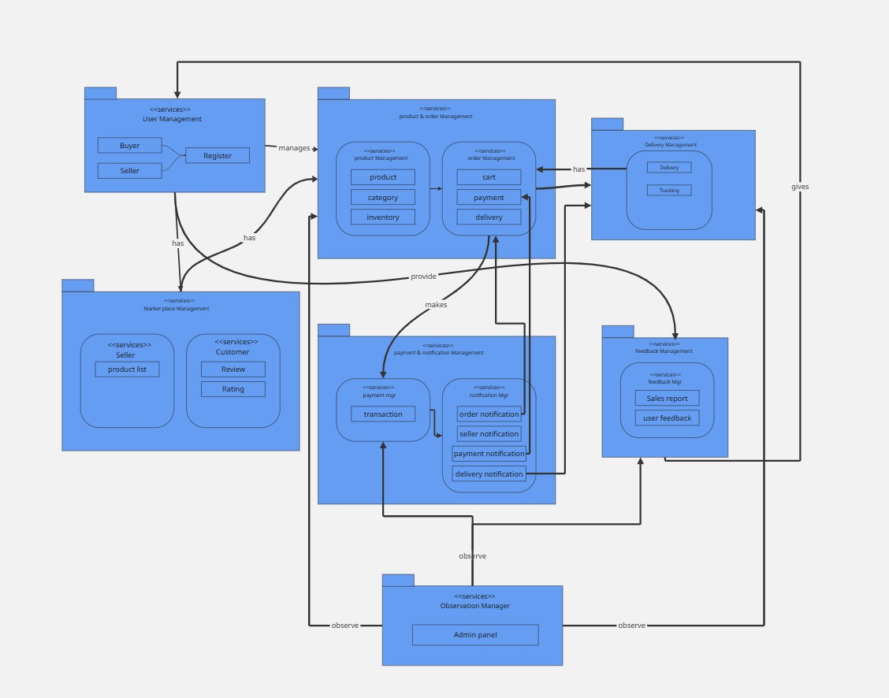

## DOMAIN MODEL

### Glossary of Domain Terms

- **Seller**: Person who sells the product.
- **Customer**: Person who buys the product.
- **List Product**: Action of seller to add the item to the marketplace.
- **Product Listed**: System confirmation of added product.
- **Search Product**: Initial action to find the desired items by the customers.
- **Select Product**: Choosing a specific product.
- **Add Product to Cart**: Place selected item in the cart.
- **Update Cart**: Modify items and quantities in the cart.
- **Enter Order Information**: Providing the billing information and delivery details.
- **Product Not Found**: Unsuccessful search result.
- **Update Inventory**: Seller's modification of stock level.
- **Inventory Updated**: System reflection of stock changes.
- **Order**: Customer’s request action to purchase product(s).
- **Cancel Order**: Terminating a purchase before completion.
- **Order Packed**: Stage where items are prepared for shipment.
- **Ship Order**: Initiation of product transportation.
- **Order Shipped**: Confirmation that products have left the shop/warehouse.
- **Confirm Delivery**: Verification of product receipt by customer.
- **Verify Payment**: Validation of payment method.
- **Payment Verified**: Successful financial transaction confirmation.
- **Payment Failed**: Unsuccessful payment attempt.
- **Fail Payment**: Rejection of payment method.
- **Track Delivery Status**: Monitor shipment progress.
- **Delivery Status Tracked**: Real-time updates on package location.
- **Send Delivery Message**: Communication about shipment details.
- **Receive Product**: Customer acknowledges item receipt.
- **Request Return**: Customer's initiation to return a product.
- **Return Requested**: Formal submission of return intent.
- **Receive Return Notification**: System acknowledgment of return request.
- **Return Confirmation**: Approval of return by seller.
- **Approve Return**: Formal acceptance of product return.
- **Return Approved**: Confirmation of return eligibility.
- **Return Product**: Physical return of merchandise.
- **Product Return**: Completed return transaction.
- **Send Order**: Transmission of order details to fulfillment system.
- **Send Delivery Message**: Notification about shipment.
- **Receive Product**: Customer receives ordered items.
- **Submit Feedback**: Customer provides post-purchase review.
- **Order Sent**: Order processed by system.
- **Delivery Message Sent**: Shipping updates communicated.
- **Product Received**: Confirmation of successful delivery.

### Local Market
### 1. User Management
- Handles user registration for buyers and sellers
- Provides the entry point for platform access
- Manages user authentication and basic profile information

### 2. Marketplace Management
- Facilitates seller product listings
- Enables sellers to:
  - Add products
  - Manage product catalogs
  - List items for sale
- Supports customer interactions through:
  - Product reviews
  - Rating systems

### 3. Product and Order Management
- Central component of the platform
- Key functionalities include:
  - Product catalog management
  - Inventory tracking
  - Shopping cart operations
  - Order processing
- Manages critical transaction flows:
  - Payment processing
  - Order creation
  - Delivery coordination

### 4. Notification and Communication System
- Handles multiple notification types:
  - Seller notifications
  - Payment confirmations
  - Delivery updates
  - Order status changes
- Ensures real-time communication between platform participants

### 5. Delivery Management
- Tracks and manages product shipments
- Provides tracking capabilities
- Coordinates logistics and delivery processes

### 6. Feedback and Reporting
- Collects user feedback
- Generates sales reports
- Supports continuous platform improvement

### 7. Observation Management
- Admin panel for system-wide monitoring
- Observes interactions across different platform components
- Enables administrative oversight and potential interventions

## Key Interaction Flows
- Users interact through registration and product browsing
- Sellers list products and manage their offerings
- Buyers can view products, make purchases, and provide feedback
- The system provides seamless communication and notification mechanisms
- Admin panel allows comprehensive platform monitoring