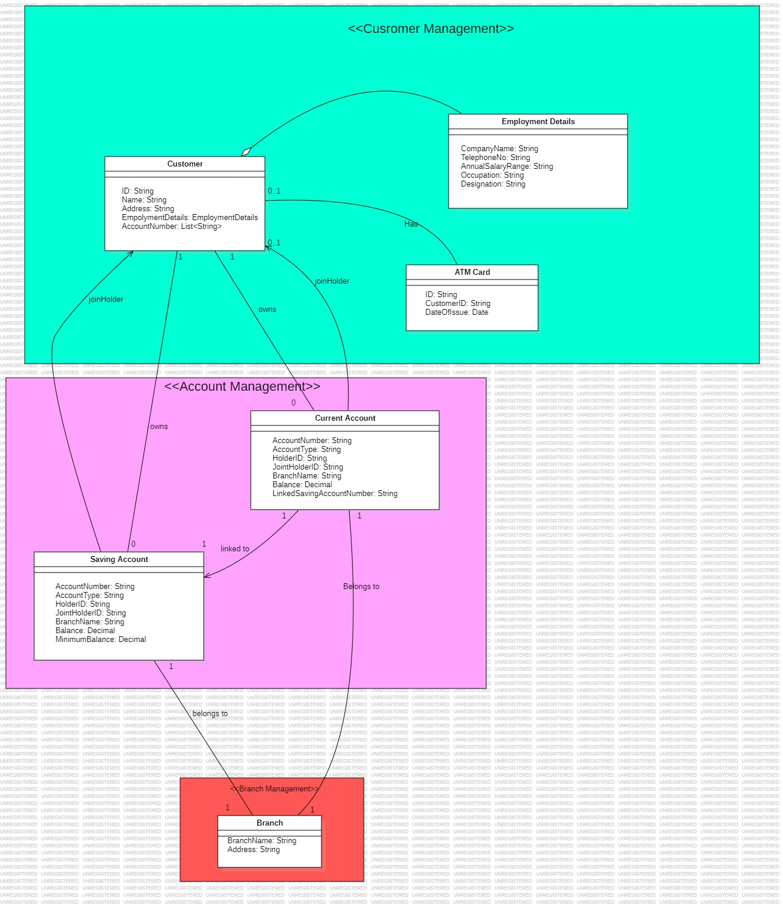

# Banking System Domain Model

## 1. Domain Objects 

### Bounded Context / Services
- **Account Management Service**
- **Customer Management Service** 
- **ATM Card Service**
- **Branch Management Service**

### Aggregates
- Customer
- Account (Saving or Current)
- Branch
- ATM Card

### Entities

#### Customer
- **ID** (String)
- **Name** (String)
- **Address** (String)
- **EmploymentDetails** (Value Object)
- **AccountNumbers** (List of Account Numbers)

#### SavingAccount
- **AccountNumber** (String)
- **AccountType** (String) = "Saving"
- **HolderID** (Customer ID)
- **JointHolderID** (Optional Customer ID)
- **BranchName** (String)
- **Balance** (Decimal)
- **MinimumBalance** (Decimal)

#### CurrentAccount
- **AccountNumber** (String)
- **AccountType** (String) = "Current"
- **HolderID** (Customer ID)
- **JointHolderID** (Optional Customer ID)
- **BranchName** (String)
- **Balance** (Decimal)
- **LinkedSavingAccountNumber** (String)

#### Branch
- **BranchName** (String)
- **Address** (String)

#### ATMCard
- **ID** (String)
- **CustomerID** (String)
- **DateOfIssue** (Date)

### Value Objects

#### EmploymentDetails
- **CompanyName** (String)
- **TelephoneNo** (String)
- **AnnualSalaryRange** (String)
- **Occupation** (String)
- **Designation** (String)

## 2. Relationships / Associations

- A **Customer** can own multiple accounts (1-to-many)
- An **Account** is held by one or two customers (1-to-2)
- A **Customer** can have only one ATM card (0-to-1)
- A **Customer** can exist even without accounts or ATM card
- An **Account** belongs to one Branch (many-to-1)
- A **Branch** has many accounts, but does not store account references (unidirectional)
- A **Current Account** must reference a linked saving account (1-to-1, mandatory)
- An **Account** references holders by their IDs